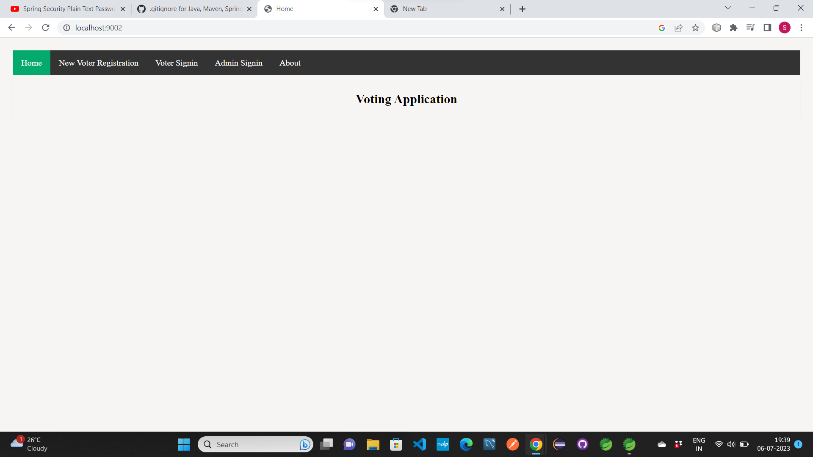
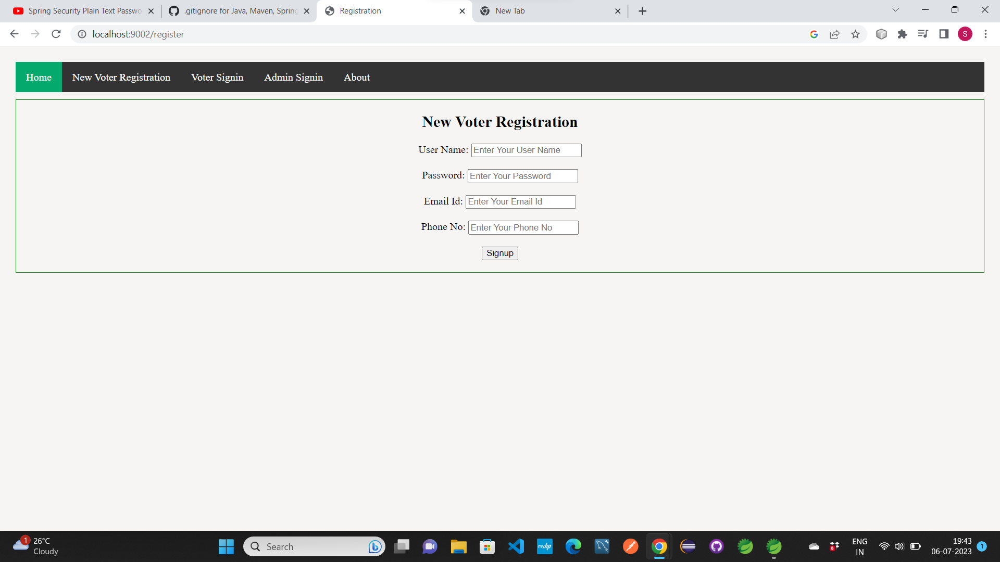
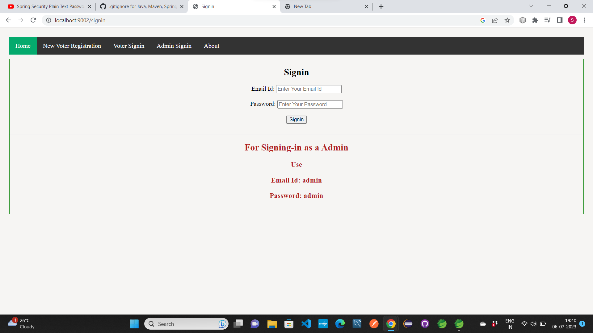
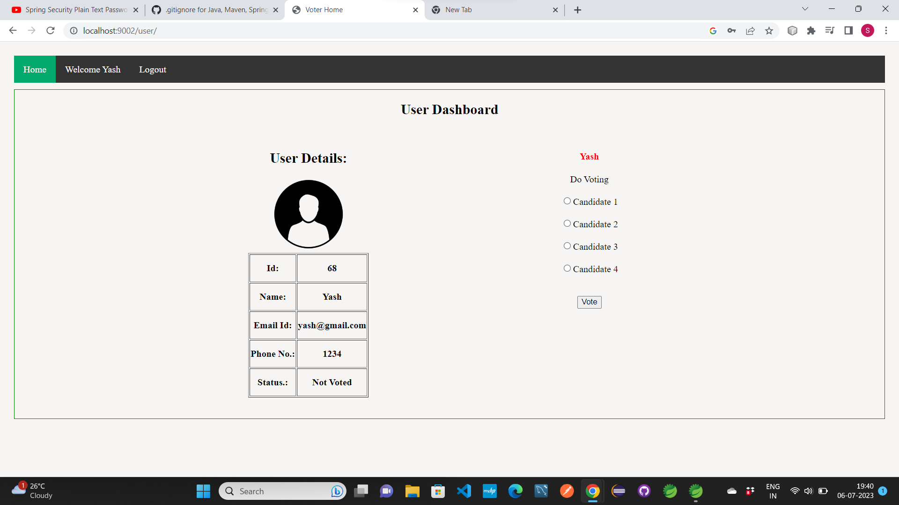
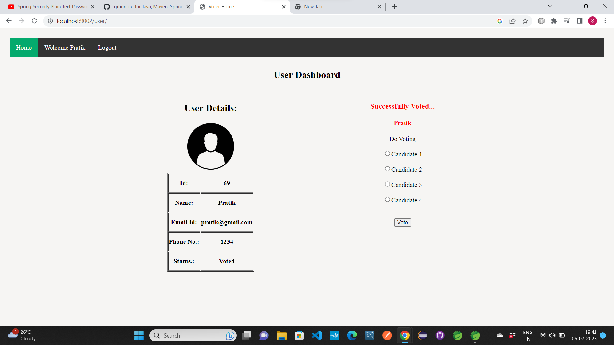
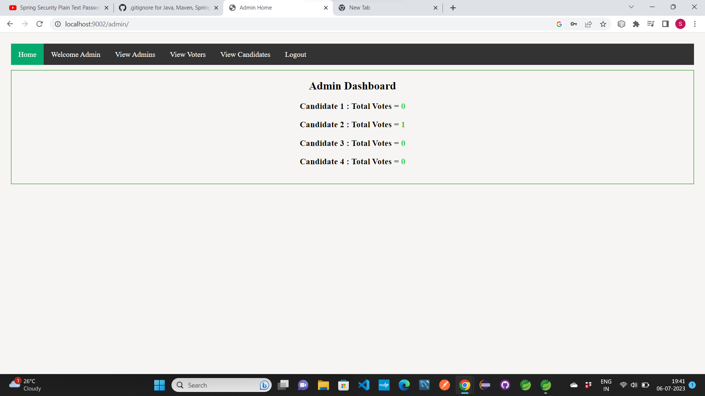
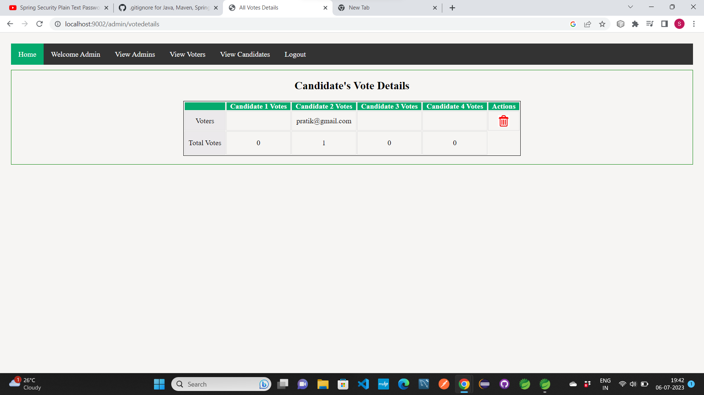

# VotingApp 

### It is SpringBoot Project. Build in Spring Tool Suite.
## It is a Voting Application. 
User can vote the Candidate, and Admin has the permission to see the vote details

### Technology used in this Project: 
- i) Thymeleaf,CSS : designing page layout. 
- ii) Java : all the logic has been written in java. 
- iii) MySQL: MySQL database has been used as database.
- iv) SpringSecurity: SpringSecurity has been used for authentication.
- v) Hibernate: Hibernate ORM is used.

### Software And Tools Required:
- Java JDK 8+ 
- Eclipse EE or Spring Tool Suite
- MySQL

   ## create database name "springbootnew" in MySQL.

    or

   (you can also create the database with different name in MySQL. but the created database
   name in MySQL should match the database name in url in application.properties file.
   so according to created database in MySQL set the database name in url in 
   application.properties 
   file.
   - Now save the changes.)
  - And Try to Run the Project

  ### If you are using Spring Tool Suite 
 -  Right Click On Project > Run As > Spring Boot App 
 -  Now in Browser Type Url: http://localhost:9002
 -  Note: In Url put Port according to your application.properties file.
 -  Application will get Open
   
 ### If you are using Eclipse EE
 - Open Project > open application.properties file >
 
  Now do some changes, Change port number according to your Tomcat Server
  and save the file. 
  
 - Right Click On Project > Run as > Spring Boot App
 - Now in Browser Type Url: http://localhost:9002
-  Note: In Url put Port according to your application.properties file.
 -  Application will get Open.

### Some Screenshots of this Project:

==================================================================================================================================================================

==================================================================================================================================================================

==================================================================================================================================================================

==================================================================================================================================================================

==================================================================================================================================================================

==================================================================================================================================================================

==================================================================================================================================================================

